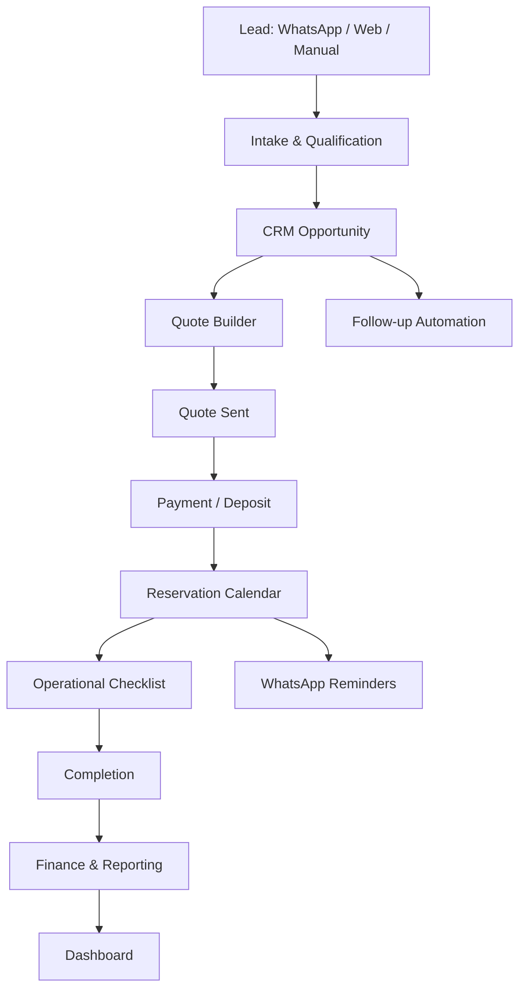

# Ficha de Producto: StudioOS

**Nombre de trabajo:** StudioOS  
**Owner propuesto:** Off Screen / Roii  
**Tipo de producto:** Micro-SaaS vertical / sistema operativo para negocios audiovisuales con activos físicos  
**Estado:** Tesis de producto para construcción y validación  
**Versión:** 0.1  
**Fecha:** 2026-04-25  
**Autoría conceptual:** Tech Lead + Product Owner  

---

## 1. Resumen ejecutivo

StudioOS es un software vertical diseñado para **automatizar la operación comercial, administrativa y financiera de foros, estudios audiovisuales, estudios de podcast, rental houses, estudios de foto, locaciones y negocios similares que rentan activos físicos creativos**.

La hipótesis central es que muchos dueños de estos negocios están en una situación parecida:

> Invirtieron en infraestructura, equipo, acondicionamiento, iluminación, audio, cámaras, espacios o sets; el mercado se ha vuelto más competido, menos predecible y más presionado por IA; no necesariamente quieren crecer como productoras o agencias, pero sí quieren que esos activos generen ingresos con la menor carga operativa posible.

StudioOS no promete llenar el calendario ni sustituir la venta comercial. Su promesa principal es:

> **Convertir un negocio audiovisual operado por WhatsApp, memoria y hojas sueltas en un sistema semi-automatizado de reservas, cotizaciones, pagos, facturación, seguimiento, operación y métricas.**

La tesis comercial es que el software puede ser atractivo porque no vende “más trabajo”, sino **menos fricción, menos seguimiento manual, más control y más pasividad operativa**.

La tesis técnica es que el producto puede iniciar como una implementación interna para Off Screen, después venderse como servicio productizado a 3-5 negocios similares y sólo entonces evolucionar a SaaS multi-tenant.

---

## 2. Veredicto de producto

### ¿Invertiría en esto?

Sí, pero con disciplina.

Invertiría en StudioOS **como herramienta interna + micro-SaaS validable**, no como startup grande, no como marketplace, no como productora y no como plataforma nacional desde el día uno.

El producto es atractivo porque:

1. Aprovecha una necesidad real de Off Screen.
2. Se alinea con la experiencia tecnológica de Roii.
3. No obliga al founder a volver a producción audiovisual.
4. Tiene potencial de empaquetarse para negocios similares.
5. Ataca eficiencia operativa, no sólo generación de demanda.
6. Puede construirse de forma incremental.
7. Permite validar con clientes pagados antes de desarrollar una plataforma completa.

La mayor alerta es que el mercado puede ser pequeño y poco acostumbrado a pagar software. Por eso el producto debe validarse con implementaciones pagadas antes de asumir que existe un SaaS escalable.

---

## 3. Problema

Los negocios audiovisuales con activos físicos suelen operar de manera informal o semimanual:

- Responden leads por WhatsApp o Instagram.
- Repiten la misma información decenas de veces.
- Cotizan manualmente.
- Confirman disponibilidad con calendarios separados.
- Persiguen anticipos.
- Olvidan seguimientos.
- No miden bien la fuente de los leads.
- No tienen claridad de rentabilidad por activo.
- Separan ventas, pagos, facturación, operación y reportes.
- Dependen demasiado del dueño o de una persona operativa.
- Pierden leads por tardar en responder.
- No tienen un pipeline comercial claro.
- No estandarizan contratos, políticas, extras, depósitos o cancelaciones.

En un mercado donde la renta de activos puede estar presionada por saturación, competencia e IA, el dueño no necesariamente quiere operar más; quiere operar mejor.

### Dolor principal

> “Quiero que mi foro, estudio o rental house genere ingresos sin que cada renta me consuma atención, seguimiento, mensajes, cobros y coordinación.”

### Dolor secundario

> “No sé exactamente qué tan rentable es mi negocio ni qué canal, activo o tipo de renta realmente deja dinero.”

---

## 4. Insight estratégico

La primera idea era crear un marketplace de renta de espacios, foros y equipo. Esa idea tiene valor, pero implica cold start, desintermediación, operación pesada, seguros, conflictos, oferta/demanda y mucho soporte.

StudioOS parte de un insight diferente:

> Antes de agregar oferta y demanda en un marketplace, muchos negocios audiovisuales necesitan profesionalizar su propia operación.

Esto reduce el riesgo porque el primer cliente puede ser Off Screen. Si el sistema reduce trabajo, mejora seguimiento y da claridad financiera en un negocio real, existe una historia comercial creíble para venderlo a otros.

La oportunidad no está en decirle a otros dueños:  
“Te voy a conseguir más clientes.”

La oportunidad está en decirles:

> “Te voy a ayudar a que los clientes que ya te llegan se atiendan mejor, se conviertan mejor, se cobren mejor y te quiten menos tiempo.”

---

## 5. Descripción del producto

StudioOS es un sistema operativo vertical para negocios de renta audiovisual.

Integra en un solo flujo:

1. Captura de leads.
2. Automatización por WhatsApp.
3. CRM.
4. Calificación del prospecto.
5. Cotizaciones.
6. Calendario y disponibilidad.
7. Reservas.
8. Anticipos y pagos.
9. Facturación o solicitud de factura.
10. Contratos, reglas y políticas.
11. Checklists operativos.
12. Medición de fuentes y campañas.
13. Reportes financieros y operativos.
14. Automatizaciones y recordatorios.
15. Asistentes con IA para atención, cotización y seguimiento.

---

## 6. Producto en una frase

> **StudioOS automatiza la renta de foros, estudios, locaciones y equipo audiovisual para que los dueños operen menos, conviertan mejor y tengan control financiero real.**

---

## 7. Lo que StudioOS NO es

StudioOS no debe venderse inicialmente como:

- Un marketplace.
- Una agencia de marketing.
- Una productora audiovisual.
- Un sistema para “llenarte el calendario”.
- Un sustituto total de una persona operativa.
- Un ERP genérico.
- Un CRM horizontal.
- Un sistema contable completo.
- Una herramienta de pauta avanzada.
- Un SaaS complejo multi-tenant desde el primer día.

La claridad de “lo que no es” es clave para evitar scope creep.

---

## 8. Usuarios y compradores

### Buyer principal

**Dueño u operador de un negocio audiovisual con activos físicos.**

Ejemplos:

- Dueño de foro.
- Dueño de estudio fotográfico.
- Dueño de estudio de podcast.
- Dueño de rental house.
- Dueño de locaciones para producción.
- Casa productora pequeña que renta infraestructura.
- Espacio creativo que renta por hora o por jornada.

### Usuario operativo

- Asistente administrativo.
- Community manager.
- Vendedor.
- Coordinador de reservas.
- Productor interno.
- Encargado de foro.
- Encargado de equipo.

### Usuario financiero

- Dueño.
- Administrador.
- Contador externo.
- Dirección general.

---

## 9. ICP inicial

El cliente ideal inicial no es el foro más grande ni el negocio más informal.

El ICP inicial es:

> Negocio audiovisual pequeño o mediano, con 1-5 personas en operación, que ya recibe leads por WhatsApp/Instagram/web, tiene al menos algunas reservas mensuales, pero opera de forma manual y depende demasiado del dueño.

### Criterios positivos

- Ya tiene inventario o activos listos.
- Ya recibe leads orgánicos o pagados.
- Cobra por anticipos.
- Tiene problemas de seguimiento.
- Usa WhatsApp como canal principal.
- Quiere profesionalizar operación.
- El dueño siente que el negocio le quita más tiempo del que debería.
- Tiene disposición a pagar setup.
- Puede beneficiarse de reportes simples.
- Tiene reglas, precios o paquetes relativamente estandarizables.

### Criterios negativos

No es buen cliente inicial si:

- No recibe leads.
- Espera que el software le genere demanda.
- No quiere pagar implementación.
- No tiene precios claros.
- Cambia condiciones en cada venta.
- Opera de forma totalmente informal.
- No usa facturación ni registros.
- No tiene a nadie que atienda la operación mínima.
- Necesita demasiada personalización desde el inicio.

---

## 10. Segmentos iniciales

### Segmento 1: Foros y estudios de contenido

Incluye foros con ciclorama, sets de video, estudios de podcast, estudios de streaming, estudios para fotografía de producto o moda.

**Dolores clave:**

- Muchas preguntas repetidas.
- Dudas sobre horarios, precios y disponibilidad.
- Necesidad de enviar ubicación, reglas y políticas.
- Seguimiento de anticipos.
- Gestión de extras como luces, audio, limpieza, horas extra y asistentes.

### Segmento 2: Rental houses pequeñas y medianas

Incluye negocios que rentan cámaras, lentes, iluminación, audio, grip, fondos, soportes, accesorios o kits.

**Dolores clave:**

- Cotizaciones con múltiples ítems.
- Disponibilidad de equipo.
- Depósitos.
- Check-in/check-out.
- Daños o faltantes.
- Pagos pendientes.
- Historial de clientes.

### Segmento 3: Locaciones y espacios creativos

Incluye casas, departamentos, rooftops, bodegas, espacios escenográficos, showrooms y espacios multipropósito.

**Dolores clave:**

- Reglas de uso.
- Horarios.
- Limpieza.
- Capacidad.
- Permisos.
- Depósitos.
- Políticas de cancelación.

### Segmento 4: Estudios híbridos

Negocios que combinan foro, equipo, producción básica, edición, UGC, podcast o servicios creativos.

**Dolores clave:**

- Necesitan cotizar paquetes, no sólo renta.
- Tienen mezcla de servicios fijos y variables.
- Requieren CRM y finanzas más claras.

---

## 11. Jobs To Be Done

### JTBD comercial

Cuando recibo un lead por WhatsApp, quiero que el sistema lo califique, lo registre y le dé seguimiento para no perder oportunidades por responder tarde o desorganizarme.

### JTBD operativo

Cuando alguien reserva mi espacio o equipo, quiero que el sistema coordine calendario, pagos, reglas, recordatorios y checklists para que la operación no dependa de mi memoria.

### JTBD financiero

Cuando termina el mes, quiero saber cuántos leads llegaron, cuántos se convirtieron, cuánto ingresó, qué está pendiente, qué activo fue rentable y qué canal valió la pena.

### JTBD de pasividad

Cuando el negocio recibe solicitudes, quiero que la mayoría de la atención ocurra en automático para que la renta de mis activos se sienta lo más pasiva posible.

---

## 12. Propuesta de valor

### Propuesta principal

> Automatiza la operación de tu foro, estudio o rental house para atender leads, cotizar, reservar, cobrar, facturar y medir sin vivir pegado a WhatsApp.

### Beneficios comerciales

- Menos leads perdidos por falta de respuesta.
- Mejor seguimiento.
- Mayor profesionalismo ante clientes.
- Cotizaciones más rápidas.
- Proceso comercial más ordenado.
- Más claridad de fuentes de adquisición.
- Mejor conversión de leads existentes.

### Beneficios operativos

- Menos mensajes repetitivos.
- Menos coordinación manual.
- Recordatorios automáticos.
- Calendario centralizado.
- Checklists de reserva.
- Reglas y políticas automatizadas.
- Mejor control de extras y horas adicionales.

### Beneficios financieros

- Visibilidad de ingresos.
- Registro de anticipos y saldos.
- Reporte por activo o servicio.
- Seguimiento de cuentas por cobrar.
- Base para facturación.
- Medición de rentabilidad aproximada.

### Beneficios emocionales para el dueño

- Menos estrés.
- Menos dependencia del dueño.
- Sensación real de negocio semi-pasivo.
- Menos culpa por tener activos subutilizados.
- Mayor control sin tener que operar más.

---

## 13. Posicionamiento comercial

### Posicionamiento recomendado

> **El sistema operativo para negocios audiovisuales que quieren rentar sus activos con menos caos y más control.**

### Mensaje alternativo

> **Renta tu foro, estudio o equipo sin vivir en WhatsApp.**

### Mensaje para dueños saturados

> **Tus activos ya están ahí. Haz que trabajen con menos intervención tuya.**

### Mensaje para negocios en baja demanda

> **No prometemos llenar tu calendario. Te ayudamos a aprovechar mejor cada lead, cobrar mejor y operar con menos tiempo.**

Este último mensaje es importante porque genera confianza. No sobrepromete.

---

## 14. Modelo comercial

### Modelo recomendado para validación

No iniciar como SaaS puro. Iniciar como:

> **Implementación productizada + mensualidad.**

Esto permite cobrar por valor inmediato, financiar desarrollo y evitar depender de cientos de clientes pequeños.

### Paquete Starter

Para negocios simples de una ubicación o un activo principal.

**Incluye:**

- WhatsApp intake.
- CRM básico.
- Pipeline de leads.
- Cotizador simple.
- Calendario de reservas.
- Recordatorios.
- Dashboard básico.

**Precio sugerido de validación:**

- Setup: $15,000 - $25,000 MXN.
- Mensualidad: $1,500 - $3,500 MXN.

### Paquete Pro

Para negocios con varios activos, paquetes o servicios.

**Incluye:**

- Todo Starter.
- Cotizaciones con extras.
- Registro de pagos.
- Solicitud de factura.
- Reporte financiero.
- Fuentes de leads.
- Automatizaciones avanzadas.
- Plantillas de contratos y políticas.

**Precio sugerido de validación:**

- Setup: $30,000 - $60,000 MXN.
- Mensualidad: $4,000 - $8,000 MXN.

### Paquete Managed Ops

Para negocios que quieren implementación, optimización y soporte continuo.

**Incluye:**

- Todo Pro.
- Configuración personalizada.
- Integraciones.
- Dashboard ejecutivo.
- Automatizaciones a medida.
- Revisión mensual de métricas.
- Soporte preferente.

**Precio sugerido de validación:**

- Setup: $60,000+ MXN.
- Mensualidad: $8,000 - $15,000+ MXN.

### Comisiones transaccionales

No recomiendo iniciar con comisión obligatoria sobre reservas. Puede generar fricción y desintermediación.

Se puede considerar a futuro sólo si StudioOS procesa pagos y genera valor claro en cobranza, protección o conciliación.

---

## 15. Hipótesis de negocio

### H1: Dolor operativo

Dueños de foros, estudios y rental houses tienen dolor real por atender leads, cotizar, reservar, cobrar y coordinar manualmente.

**Validación:** entrevistas y pilotos.

### H2: Disposición de pago

Al menos algunos negocios están dispuestos a pagar setup + mensualidad por reducir trabajo operativo.

**Validación:** 3 clientes pagados antes de construir SaaS multi-tenant.

### H3: Off Screen como caso de uso

La implementación interna en Off Screen reduce tiempo operativo, mejora seguimiento y da métricas útiles.

**Validación:** antes/después en 30-60 días.

### H4: Producto replicable

El flujo de Off Screen se parece lo suficiente al de otros foros/estudios como para empaquetarlo.

**Validación:** 5 demos con dueños y 2 pilotos externos.

### H5: Valor sin prometer demanda

El producto puede venderse sin prometer “más clientes”, sólo eficiencia, control y conversión de leads existentes.

**Validación:** objeciones comerciales durante discovery.

---

## 16. Criterios de éxito para validación

### En Off Screen

En 60 días, el sistema debe lograr:

- Reducir tiempo de atención manual por lead.
- Capturar el 90%+ de leads entrantes en CRM.
- Enviar respuesta inicial automática en menos de 1 minuto.
- Registrar fuente de lead en al menos 70% de los casos.
- Tener pipeline visible de oportunidades.
- Registrar cotizaciones, reservas, anticipos y saldos.
- Entregar reporte mensual de ingresos, reservas y conversión.

### En mercado externo

En 90 días, validar:

- 15 entrevistas con dueños u operadores.
- 5 demos con datos/proceso real.
- 3 propuestas formales enviadas.
- 2 pilotos pagados.
- Al menos 1 cliente externo dispuesto a pagar mensualidad después del setup.

### Señal fuerte

La mejor señal no es que digan “suena interesante”.

La señal fuerte es:

> “¿Cuándo me lo instalas y cuánto cuesta?”

---

## 17. Criterios para NO construir

No avanzar a SaaS si ocurre lo siguiente:

- Los prospectos sólo quieren más clientes, no automatización.
- No quieren pagar setup.
- El ticket aceptable es demasiado bajo.
- Cada cliente requiere personalización extrema.
- La implementación consume demasiadas horas.
- Los dueños no usan el sistema después de instalado.
- El mercado pide funciones de agencia/marketing en vez de operación.
- Nadie quiere pagar mensualidad.
- No hay similitud suficiente entre flujos de operación.

---

## 18. MVP funcional

### Objetivo del MVP

Crear una versión funcional que automatice la operación básica de Off Screen y pueda demostrarse a otros negocios similares.

### Alcance MVP

El MVP debe resolver un flujo completo:

> Lead entra → se califica → se registra en CRM → se cotiza → se reserva → se cobra anticipo → se confirma calendario → se envían instrucciones → se registra cierre → se reporta.

### Fuera del MVP

No incluir inicialmente:

- Marketplace público.
- App móvil nativa.
- Multi-sucursal complejo.
- Revenue share.
- Inventario avanzado tipo rental house enterprise.
- Contabilidad completa.
- Conciliación bancaria automática avanzada.
- Integración profunda con Meta Ads.
- Motor complejo de disponibilidad.
- Portal avanzado de clientes.
- Portal avanzado de proveedores.
- IA generativa compleja.

---

## 19. Módulos del MVP

### Módulo 1: Captura de leads

**Canales iniciales:**

- WhatsApp.
- Formulario web.
- Carga manual.
- Instagram vía enlace a WhatsApp o formulario.

**Datos mínimos:**

- Nombre.
- Teléfono.
- Email opcional.
- Empresa opcional.
- Fecha requerida.
- Horario.
- Tipo de servicio.
- Número de personas.
- Requiere factura.
- Requiere equipo.
- Fuente.
- Presupuesto aproximado.
- Notas.

### Módulo 2: WhatsApp intake

El bot debe hacer preguntas de calificación y registrar respuestas.

**Flujo base:**

1. Saludo.
2. Tipo de servicio.
3. Fecha y horario.
4. Número de personas.
5. Necesidades adicionales.
6. Requerimiento de factura.
7. Datos de contacto.
8. Mensaje de confirmación.
9. Promesa de seguimiento.

**Principio clave:**

El bot no debe intentar cerrar todo. Debe calificar, ordenar y acelerar.

### Módulo 3: CRM

Pipeline mínimo:

1. Nuevo lead.
2. Calificado.
3. Cotización pendiente.
4. Cotización enviada.
5. Anticipo pendiente.
6. Reservado.
7. Completado.
8. Perdido.
9. Cancelado.

**Funciones:**

- Crear oportunidad.
- Mover etapa.
- Asignar responsable.
- Agregar notas.
- Ver historial.
- Programar seguimiento.
- Etiquetar fuente.
- Marcar motivo de pérdida.

### Módulo 4: Cotizador

Genera cotizaciones a partir de reglas configurables.

**Componentes:**

- Servicio base.
- Horas incluidas.
- Costo por hora extra.
- Extras.
- Descuentos.
- Depósito.
- IVA o indicación fiscal.
- Vigencia.
- Términos.
- Políticas de cancelación.
- Link de aceptación.

**Salida:**

- PDF o página compartible.
- Mensaje de WhatsApp.
- Email opcional.

### Módulo 5: Calendario y reservas

**Funciones:**

- Ver calendario.
- Crear reserva.
- Bloquear horario.
- Asociar reserva a oportunidad.
- Estatus de pago.
- Datos del cliente.
- Servicios incluidos.
- Notas operativas.
- Recordatorios.

**Reglas:**

- Una reserva no debe marcarse como confirmada sin anticipo o autorización manual.
- Debe existir un estado intermedio: “apartado pendiente de pago”.

### Módulo 6: Pagos

**MVP mínimo:**

- Registro manual de transferencia.
- Link de pago opcional.
- Monto total.
- Anticipo.
- Saldo.
- Fecha de pago.
- Comprobante adjunto.
- Estatus.

**Estados:**

- Sin pago.
- Anticipo pendiente.
- Anticipo pagado.
- Liquidado.
- Reembolsado.
- Cancelado.

### Módulo 7: Facturación

**MVP mínimo:**

- Solicitar datos fiscales.
- Registrar si requiere factura.
- Guardar RFC, razón social, régimen fiscal, uso CFDI, email fiscal.
- Generar tarea de facturación.
- Registrar factura emitida.
- Adjuntar XML/PDF o link.

**Nota técnica:**

La integración directa con PAC o CFDI puede ser fase 2. En MVP basta con estructurar el flujo.

### Módulo 8: Operación y checklists

**Checklists recomendados:**

- Pre-reserva.
- Confirmación de pago.
- Preparación del espacio.
- Check-in.
- Check-out.
- Limpieza.
- Daños o incidentes.
- Horas extra.
- Cierre financiero.

**Automatizaciones:**

- Enviar reglas un día antes.
- Enviar ubicación.
- Recordar saldo pendiente.
- Recordar hora de llegada.
- Pedir feedback después del servicio.

### Módulo 9: Dashboard

Dashboard mínimo:

- Leads recibidos.
- Leads calificados.
- Cotizaciones enviadas.
- Reservas confirmadas.
- Conversión lead → reserva.
- Ingresos confirmados.
- Ingresos pendientes.
- Ticket promedio.
- Ocupación por semana/mes.
- Fuente de leads.
- Motivos de pérdida.
- Servicios más vendidos.

### Módulo 10: Administración

**Configuraciones:**

- Servicios.
- Paquetes.
- Precios.
- Extras.
- Horarios.
- Políticas.
- Mensajes de WhatsApp.
- Usuarios.
- Roles.
- Métodos de pago.
- Datos fiscales.
- Plantillas de cotización.

---

## 20. Requerimientos funcionales

### RF-001: Captura de lead

El sistema debe crear un lead desde WhatsApp, formulario web o carga manual.

### RF-002: Calificación automática

El sistema debe solicitar datos mínimos al prospecto y guardarlos en una oportunidad.

### RF-003: Pipeline comercial

El sistema debe permitir visualizar y mover oportunidades entre etapas.

### RF-004: Cotización

El sistema debe permitir generar una cotización con servicios, extras, impuestos, depósito, vigencia y términos.

### RF-005: Envío de cotización

El sistema debe permitir compartir cotizaciones por link, WhatsApp o correo.

### RF-006: Reserva

El sistema debe permitir crear reservas asociadas a clientes, fechas, horarios, servicios y pagos.

### RF-007: Pagos

El sistema debe registrar anticipos, saldos, comprobantes y estatus de pago.

### RF-008: Calendario

El sistema debe mostrar reservas y bloqueos en calendario.

### RF-009: Recordatorios

El sistema debe enviar recordatorios automáticos al cliente y al operador.

### RF-010: Datos fiscales

El sistema debe capturar datos fiscales para facturación.

### RF-011: Reportes

El sistema debe generar reportes de leads, ventas, ingresos, conversión y ocupación.

### RF-012: Configuración de servicios

El sistema debe permitir configurar servicios, paquetes, precios y extras.

### RF-013: Roles

El sistema debe permitir roles básicos: owner, admin, vendedor, operador, viewer.

### RF-014: Historial

El sistema debe guardar historial de interacciones, cambios de etapa, cotizaciones, pagos y reservas.

---

## 21. Requerimientos no funcionales

### RNF-001: Simplicidad

El sistema debe ser usable por negocios pequeños sin equipo técnico.

### RNF-002: Tiempo de respuesta

La respuesta automática inicial por WhatsApp debe ocurrir en menos de 60 segundos.

### RNF-003: Disponibilidad

El sistema debe estar disponible al menos 99% en horario comercial.

### RNF-004: Seguridad

Los datos de clientes, pagos y facturación deben almacenarse de forma segura.

### RNF-005: Auditoría

Acciones críticas deben quedar registradas: pagos, cambios de reserva, cancelaciones, cambios de precio.

### RNF-006: Escalabilidad razonable

La arquitectura debe soportar múltiples tenants en el futuro, aunque el MVP pueda iniciar single-tenant.

### RNF-007: Integrabilidad

El sistema debe diseñarse para conectar WhatsApp, calendario, pagos, facturación, CRM, analítica y formularios.

### RNF-008: Baja fricción

El usuario operativo debe poder registrar una reserva o cotización en menos de 3 minutos.

---

## 22. Arquitectura técnica propuesta

### Enfoque recomendado

Construir primero una arquitectura modular, pero no sobrediseñada.

El MVP puede iniciar como aplicación web monolítica modular con integraciones externas. No se recomienda microservicios al inicio.

### Stack sugerido

#### Frontend

- Next.js o React.
- Tailwind CSS o sistema de diseño simple.
- Componentes administrativos.
- PWA opcional para uso móvil.

#### Backend

- Node.js con NestJS o Fastify.
- Alternativa: Next.js full-stack si se quiere velocidad.
- API REST inicialmente.
- Webhooks para WhatsApp, pagos y formularios.

#### Base de datos

- PostgreSQL.
- Prisma o Drizzle ORM.
- Esquema preparado para multi-tenant.

#### Auth

- Auth.js, Clerk, Supabase Auth o Cognito.
- Roles básicos.
- Sesiones seguras.

#### Mensajería / jobs

- Cola simple: BullMQ + Redis.
- Alternativa inicial: cron jobs + proveedor externo.
- Uso: recordatorios, mensajes programados, reintentos, webhooks.

#### Archivos

- S3-compatible storage.
- Guardar comprobantes, PDFs, contratos, adjuntos fiscales.

#### WhatsApp

- WhatsApp Business Platform.
- Proveedor recomendado para rapidez: Twilio, 360dialog, WATI, Zenvia o similar.
- Webhooks entrantes.
- Plantillas aprobadas para mensajes proactivos.

#### Pagos

- Stripe, Mercado Pago, Conekta u otro proveedor local.
- MVP puede iniciar con registro manual de transferencia.
- Preparar modelo de datos para payment provider.

#### Facturación

- Fase 1: captura de datos fiscales y tarea de facturación.
- Fase 2: integración con PAC o proveedor CFDI.
- Fase 3: emisión automática condicionada.

#### Calendario

- Calendario interno.
- Exportación iCal.
- Integración futura con Google Calendar.

#### Analytics

- Eventos internos.
- PostHog, Amplitude o analítica propia.
- UTM capture en formularios.
- Fuente manual para WhatsApp.

#### Infraestructura

- Vercel / Railway / Render para MVP.
- Supabase / Neon / RDS para PostgreSQL.
- Redis administrado.
- Object storage.
- Logs centralizados.

---

## 23. Arquitectura lógica

---

## 24. Modelo de datos conceptual

### Tenant

Representa cada negocio cliente.

Campos:

- id
- name
- legal_name
- timezone
- country
- currency
- settings
- created_at

### User

Usuarios internos.

Campos:

- id
- tenant_id
- name
- email
- phone
- role
- status
- created_at

### Lead

Prospecto inicial.

Campos:

- id
- tenant_id
- name
- phone
- email
- source
- campaign
- first_message
- status
- created_at

### Customer

Cliente consolidado.

Campos:

- id
- tenant_id
- name
- phone
- email
- company
- fiscal_required
- fiscal_profile_id
- notes

### Opportunity

Oportunidad comercial.

Campos:

- id
- tenant_id
- lead_id
- customer_id
- pipeline_stage
- service_type
- requested_date
- requested_start_time
- requested_end_time
- estimated_value
- probability
- owner_user_id
- lost_reason
- created_at
- updated_at

### Service

Servicio o paquete vendible.

Campos:

- id
- tenant_id
- name
- description
- base_price
- pricing_unit
- included_hours
- extra_hour_price
- tax_behavior
- active

### Asset

Activo físico.

Campos:

- id
- tenant_id
- type
- name
- description
- location
- capacity
- status
- base_price
- metadata

### Quote

Cotización.

Campos:

- id
- tenant_id
- opportunity_id
- customer_id
- quote_number
- subtotal
- discount
- tax
- deposit_required
- total
- valid_until
- status
- terms
- created_at

### QuoteItem

Ítems de cotización.

Campos:

- id
- quote_id
- item_type
- description
- quantity
- unit_price
- total

### Reservation

Reserva confirmada o apartada.

Campos:

- id
- tenant_id
- opportunity_id
- customer_id
- asset_id
- start_time
- end_time
- status
- total_amount
- deposit_amount
- balance_due
- notes
- created_at

### Payment

Registro de pago.

Campos:

- id
- tenant_id
- reservation_id
- customer_id
- amount
- method
- provider
- provider_payment_id
- status
- proof_file_id
- paid_at

### FiscalProfile

Datos fiscales.

Campos:

- id
- tenant_id
- customer_id
- rfc
- legal_name
- tax_regime
- cfdi_use
- fiscal_zip
- fiscal_email

### Invoice

Registro de factura.

Campos:

- id
- tenant_id
- reservation_id
- customer_id
- fiscal_profile_id
- status
- uuid
- pdf_file_id
- xml_file_id
- issued_at

### Message

Historial de comunicación.

Campos:

- id
- tenant_id
- lead_id
- customer_id
- channel
- direction
- body
- provider_message_id
- status
- created_at

### Automation

Reglas de automatización.

Campos:

- id
- tenant_id
- trigger
- conditions
- action
- active

### Task

Tareas internas.

Campos:

- id
- tenant_id
- opportunity_id
- reservation_id
- assigned_to
- title
- due_at
- status

---

## 25. Integraciones

### WhatsApp

Prioridad alta.

Casos de uso:

- Responder leads.
- Hacer preguntas de calificación.
- Enviar cotización.
- Recordar pago.
- Enviar reglas.
- Enviar ubicación.
- Solicitar feedback.

### Google Calendar

Prioridad media.

Casos de uso:

- Sincronizar reservas.
- Ver disponibilidad.
- Bloquear horarios.

### Pagos

Prioridad media.

Casos de uso:

- Link de anticipo.
- Confirmación de pago.
- Registro automático.
- Reembolsos futuros.

### Facturación

Prioridad media-alta por diferenciación en México.

Casos de uso:

- Capturar datos fiscales.
- Crear tarea de facturación.
- Emitir CFDI en fase posterior.

### Meta Ads / Google Ads

Prioridad baja en MVP.

Casos de uso:

- Fuente de lead.
- Campaña.
- Costo por lead.
- Costo por reserva.
- ROAS aproximado.

No construir integración profunda al inicio. Usar UTMs, formularios y carga manual.

---

## 26. IA en el producto

La IA no debe ser el núcleo inicial, pero sí puede elevar el valor.

### Casos útiles de IA

1. Clasificación automática de leads.
2. Resumen de conversación.
3. Sugerencia de cotización.
4. Detección de intención.
5. Detección de urgencia.
6. Redacción de respuestas.
7. Extracción de fecha, horario, servicio y presupuesto desde mensajes.
8. Sugerencia de siguiente acción.
9. Identificación de leads no calificados.
10. Generación de reportes ejecutivos mensuales.

### Guardrails

- La IA no debe confirmar reservas sin reglas claras.
- La IA no debe prometer disponibilidad si no está validada.
- La IA no debe negociar precios sin autorización.
- La IA no debe emitir facturas sin validación.
- La IA no debe manejar conflictos delicados sin escalar a humano.
- Toda automatización crítica debe tener trazabilidad.

### Posicionamiento de IA

No vender como “IA mágica”.

Vender como:

> “Asistentes que reducen mensajes repetitivos, ordenan leads y ayudan a dar seguimiento.”

---

## 27. Flujo comercial recomendado

### Paso 1: Demo con caso real

Mostrar Off Screen como caso:

- Antes: leads dispersos, atención manual, poca visibilidad.
- Después: pipeline, WhatsApp, cotizaciones, pagos, reservas y dashboard.

### Paso 2: Diagnóstico

Preguntar:

- ¿Cuántos leads recibes al mes?
- ¿Por dónde entran?
- ¿Cuánto tardas en responder?
- ¿Cuántas cotizaciones envías?
- ¿Cuántas se convierten?
- ¿Cómo cobras anticipos?
- ¿Cómo facturas?
- ¿Cómo registras reservas?
- ¿Quién atiende WhatsApp?
- ¿Cuántas horas al mes dedicas a operación?
- ¿Qué se te olvida más?
- ¿Qué parte te molesta más?

### Paso 3: Propuesta de implementación

No vender módulos. Vender resultado:

> “En 2-4 semanas dejamos tu flujo de lead a reserva automatizado y medible.”

### Paso 4: Setup

Configurar:

- Servicios.
- Precios.
- Políticas.
- Mensajes.
- CRM.
- Calendario.
- Usuarios.
- Plantillas.
- Reportes.

### Paso 5: Acompañamiento

Primer mes con soporte cercano para ajustar flujos.

### Paso 6: Mensualidad

Soporte, hosting, mejoras, automatizaciones y reportes.

---

## 28. Roadmap de construcción

### Fase 0: Diseño y dogfooding

Duración sugerida: 1-2 semanas.

Entregables:

- Mapa de flujo actual de Off Screen.
- Definición de servicios y precios.
- Pipeline.
- Plantillas de mensajes.
- Plantillas de cotización.
- Modelo de datos inicial.
- Dashboard mock.
- Métricas base actuales.

### Fase 1: MVP interno Off Screen

Duración sugerida: 3-5 semanas.

Entregables:

- Formulario o WhatsApp intake.
- CRM simple.
- Cotizador.
- Reservas.
- Registro de pagos.
- Datos fiscales.
- Recordatorios.
- Dashboard básico.

Criterio de salida:

- El sistema puede operar el flujo real de Off Screen con mínima intervención.

### Fase 2: Pilotos externos

Duración sugerida: 4-8 semanas.

Entregables:

- Multi-tenant básico o instancia duplicable.
- Configuración por cliente.
- Onboarding.
- Reportes.
- Soporte.
- Documentación interna.

Criterio de salida:

- 2-3 clientes externos pagados.

### Fase 3: Producto empaquetado

Duración sugerida: 8-12 semanas.

Entregables:

- Panel de configuración.
- Mejor onboarding.
- Roles.
- Billing SaaS.
- Plantillas por tipo de negocio.
- Integraciones estables.
- Seguridad y auditoría.
- Help center.

Criterio de salida:

- 5-10 clientes activos con uso recurrente.

### Fase 4: SaaS vertical escalable

Sólo si hay tracción.

Entregables:

- Self-serve parcial.
- Marketplace de integraciones.
- Reportes avanzados.
- Automatizaciones configurables.
- Facturación integrada.
- Pagos integrados.
- IA más profunda.
- Benchmarks por industria.

---

## 29. Plan de validación comercial

### Semana 1: Preparación

- Documentar flujo de Off Screen.
- Definir demo conceptual.
- Armar landing simple.
- Crear pitch deck de 5 slides.
- Crear lista de 30 prospectos.

### Semana 2-3: Entrevistas

Hacer 15 entrevistas con dueños u operadores.

Preguntas clave:

1. ¿Cómo recibes leads hoy?
2. ¿Cuánto tiempo dedicas a responder?
3. ¿Cómo cotizas?
4. ¿Cómo apartas fechas?
5. ¿Cómo cobras anticipos?
6. ¿Cómo das seguimiento?
7. ¿Qué se pierde o se olvida?
8. ¿Qué parte te quita más tiempo?
9. ¿Qué reportes te gustaría ver?
10. ¿Pagarías por automatizarlo?
11. ¿Pagarías setup?
12. ¿Cuál sería un precio razonable?
13. ¿Qué tendría que incluir para que digas que sí?
14. ¿Quién usaría el sistema?
15. ¿Qué te impediría comprarlo?

### Semana 4-6: MVP interno

Construir flujo de Off Screen.

Métricas antes/después:

- Tiempo promedio de respuesta.
- Leads registrados.
- Cotizaciones enviadas.
- Reservas generadas.
- Conversión.
- Tiempo operativo estimado.
- Ingresos registrados.
- Errores o pérdidas de seguimiento.

### Semana 7-10: Pilotos pagados

Vender 2-3 implementaciones.

Validar:

- Tiempo de implementación.
- Soporte requerido.
- Nivel de personalización.
- Uso real.
- Retención.
- Valor percibido.
- Disposición a mensualidad.

### Semana 11-12: Decisión

Decidir:

- Construir producto.
- Mantener como herramienta interna.
- Vender como implementación boutique.
- Pausar.

---

## 30. Métricas de producto

### Métricas de adquisición

- Prospectos contactados.
- Demos agendadas.
- Demos realizadas.
- Propuestas enviadas.
- Propuestas aceptadas.
- CAC estimado.

### Métricas de activación

- Tiempo de implementación.
- Servicios configurados.
- Usuarios activos.
- WhatsApp conectado.
- Primer lead registrado.
- Primera cotización generada.
- Primera reserva registrada.

### Métricas de uso

- Leads capturados.
- Cotizaciones generadas.
- Mensajes automatizados.
- Reservas creadas.
- Pagos registrados.
- Tareas completadas.
- Reportes consultados.

### Métricas de valor

- Tiempo ahorrado estimado.
- Leads no perdidos.
- Conversión lead → reserva.
- Ingresos registrados.
- Saldo pendiente recuperado.
- Reducción de mensajes manuales.
- Claridad de rentabilidad.

### Métricas de negocio

- MRR.
- Setup revenue.
- Margen por implementación.
- Churn.
- Expansion revenue.
- Soporte por cliente.
- Payback de CAC.

---

## 31. North Star Metric

La North Star no debe ser “número de usuarios”.

Propuesta:

> **Reservas gestionadas exitosamente con intervención manual reducida.**

Métrica operativa:

> Número de reservas completadas usando StudioOS, con cotización, pago, recordatorios y cierre registrados.

Esto mide uso real, valor y conexión con ingresos.

---

## 32. User stories prioritarias

### P0

- Como dueño, quiero capturar automáticamente leads de WhatsApp para no perder conversaciones.
- Como operador, quiero ver todos los leads en un pipeline para saber qué sigue.
- Como vendedor, quiero generar una cotización rápido para responder al cliente.
- Como operador, quiero crear una reserva en calendario para bloquear fecha y horario.
- Como dueño, quiero registrar pagos y saldos para saber quién debe.
- Como operador, quiero enviar recordatorios automáticos para reducir seguimiento manual.
- Como dueño, quiero ver un dashboard mensual de leads, reservas e ingresos.

### P1

- Como operador, quiero solicitar datos fiscales para facilitar facturación.
- Como dueño, quiero saber de qué fuente vienen los leads.
- Como vendedor, quiero duplicar cotizaciones frecuentes.
- Como operador, quiero usar plantillas de mensajes.
- Como dueño, quiero ver ocupación por activo.
- Como admin, quiero configurar servicios, precios y extras.

### P2

- Como dueño, quiero integrar pagos en línea.
- Como admin, quiero sincronizar Google Calendar.
- Como operador, quiero checklists de entrada y salida.
- Como dueño, quiero reportes por campaña.
- Como vendedor, quiero sugerencias de IA para responder leads.
- Como admin, quiero automatizaciones configurables.

### P3

- Como dueño, quiero emitir CFDI automáticamente.
- Como admin, quiero integraciones profundas con Meta Ads.
- Como operador, quiero gestión avanzada de inventario.
- Como cliente final, quiero un portal para aceptar cotización y pagar.
- Como owner multi-sucursal, quiero reportes comparativos.

---

## 33. Riesgos

### Riesgo 1: Mercado pequeño

El mercado de foros y rental houses puede ser más chico de lo deseado.

**Mitigación:** ampliar a estudios de podcast, foto, locaciones, espacios creativos, estudios de contenido y otros negocios de renta por hora.

### Riesgo 2: Baja disposición de pago

Los negocios audiovisuales pequeños pueden no querer pagar SaaS.

**Mitigación:** vender implementación con ROI claro y mensualidad baja/moderada. No depender inicialmente de volumen masivo.

### Riesgo 3: Personalización excesiva

Cada negocio puede operar distinto.

**Mitigación:** crear plantillas por tipo de negocio y limitar alcance inicial.

### Riesgo 4: Se confunde con agencia de marketing

Prospectos pueden esperar generación de leads.

**Mitigación:** posicionamiento claro: operación, seguimiento, control y medición; no promesa de demanda.

### Riesgo 5: Soporte intensivo

Clientes poco técnicos pueden requerir mucho acompañamiento.

**Mitigación:** onboarding guiado, plantillas, videos, soporte acotado por plan.

### Riesgo 6: WhatsApp como dependencia crítica

Cambios en WhatsApp Business, costos o plantillas pueden afectar el producto.

**Mitigación:** arquitectura con adaptadores de mensajería y canales alternativos.

### Riesgo 7: Facturación fiscal compleja

Integración CFDI puede aumentar complejidad.

**Mitigación:** iniciar con captura de datos y tareas de facturación; integrar emisión después.

### Riesgo 8: El founder pierde foco

El producto puede convertirse en otro negocio operativo que distraiga de Roii.

**Mitigación:** límites claros de inversión, pilotos pagados, no construir features sin validación.

---

## 34. Ventajas competitivas posibles

### Ventaja 1: Experiencia real

Off Screen sirve como laboratorio y caso real.

### Ventaja 2: Expertise tecnológico

Roii puede construir automatizaciones, integraciones, datos e IA mejor que un proveedor genérico.

### Ventaja 3: Entendimiento de operación audiovisual

No se diseña desde fuera; se entiende la lógica de foro, equipo, renta, anticipos, horarios, extras y clientes creativos.

### Ventaja 4: Verticalización

Un CRM genérico no habla el idioma de reservas, foros, equipo, cotizaciones por hora, políticas de espacio, depósitos y checklists.

### Ventaja 5: México

Integrar WhatsApp, facturación, pagos, fiscalidad y operación local puede diferenciar frente a herramientas internacionales genéricas.

---

## 35. Diferenciación frente a herramientas genéricas

### Contra CRM genérico

StudioOS incluye reservas, cotizaciones, políticas, activos, pagos, checklists y WhatsApp desde el flujo audiovisual.

### Contra calendarios

StudioOS no sólo bloquea fechas; conecta lead, cotización, pago, instrucciones y reporte.

### Contra WhatsApp Business simple

StudioOS registra, mide, automatiza y conecta la conversación con pipeline, reserva y finanzas.

### Contra ERPs

StudioOS es más simple, más barato y más enfocado en negocios pequeños de renta creativa.

### Contra marketplaces

StudioOS no obliga a competir por precio ni a entregar clientes a una plataforma. Mejora la operación del negocio propio.

---

## 36. Pitch comercial

### Pitch corto

> StudioOS ayuda a foros, estudios y rental houses a automatizar WhatsApp, CRM, cotizaciones, reservas, pagos, facturación y reportes para que sus activos generen ingresos con menos operación manual.

### Pitch consultivo

> Muchos estudios y foros no necesitan otra plataforma que les prometa clientes; necesitan dejar de perder leads, perseguir anticipos, olvidar seguimientos y operar todo desde WhatsApp. StudioOS convierte ese flujo en un sistema medible y semi-automatizado.

### Pitch emocional

> Ya invertiste en tu espacio y tu equipo. Ahora toca que operen con menos dependencia de ti.

---

## 37. Objeciones y respuestas

### “Lo que necesito son más clientes, no software.”

Respuesta:

> Justo por eso el primer paso es no perder ni mal atender los leads que ya llegan. StudioOS no reemplaza tu marketing, pero mejora conversión, seguimiento y control para que cada lead valga más.

### “Yo ya uso WhatsApp Business.”

Respuesta:

> WhatsApp Business ayuda a responder, pero no conecta pipeline, cotizaciones, calendario, pagos, facturación y reportes. StudioOS convierte WhatsApp en un flujo operativo completo.

### “Mi negocio es muy específico.”

Respuesta:

> Por eso no vendemos un CRM genérico. Partimos de plantillas para foros, estudios y renta audiovisual, y configuramos tus servicios, reglas y proceso.

### “No quiero pagar mensualidad.”

Respuesta:

> La mensualidad cubre hosting, soporte, WhatsApp, mejoras, automatizaciones y reportes. La pregunta es si el sistema te ahorra más tiempo y errores de lo que cuesta.

### “No quiero cambiar mi forma de trabajar.”

Respuesta:

> El objetivo no es obligarte a operar distinto; es automatizar lo que ya haces y darte visibilidad.

---

## 38. Landing page recomendada

### Hero

**Renta tu foro, estudio o equipo sin vivir en WhatsApp.**

Automatiza leads, cotizaciones, reservas, pagos, facturación y reportes en un sistema diseñado para negocios audiovisuales.

CTA: **Agenda diagnóstico**  
CTA secundario: **Ver demo**

### Sección problema

Tu negocio no debería depender de recordar quién pidió fecha, quién debe anticipo, quién necesita factura y qué cotización quedó pendiente.

### Sección solución

StudioOS centraliza:

- WhatsApp.
- CRM.
- Cotizaciones.
- Calendario.
- Pagos.
- Facturación.
- Checklists.
- Reportes.

### Sección beneficios

- Responde más rápido.
- Pierde menos leads.
- Cobra mejor.
- Coordina menos manualmente.
- Mide ingresos y ocupación.
- Opera con más calma.

### Sección para quién es

- Foros.
- Estudios de foto/video.
- Estudios de podcast.
- Rental houses.
- Locaciones.
- Espacios creativos.

### Sección CTA

Agenda un diagnóstico de 30 minutos y recibe un mapa de automatización para tu operación.

---

## 39. Diseño de demo

La demo debe mostrar un flujo, no features aisladas.

### Demo flow

1. Entra lead por WhatsApp.
2. Bot pregunta datos.
3. Aparece oportunidad en CRM.
4. Se genera cotización.
5. Se envía por WhatsApp.
6. Cliente acepta.
7. Se registra anticipo.
8. Se crea reserva.
9. Se envían instrucciones.
10. Se completa checklist.
11. Dashboard muestra resultado.

### Mensaje de demo

> “Esto es lo que pasa desde que alguien te escribe hasta que la reserva queda cobrada y operada.”

---

## 40. Operación interna de StudioOS

### Roles internos

- Product owner.
- Tech lead.
- Full-stack developer.
- Automation specialist.
- Implementation specialist.
- Customer success part-time.

### Riesgo organizacional

Si cada implementación requiere demasiada intervención del equipo senior, el negocio no escala.

Desde el inicio se deben documentar:

- Onboarding.
- Checklist de implementación.
- Plantillas.
- Scripts de ventas.
- Preguntas de diagnóstico.
- Configuraciones estándar.
- Límites de personalización.

---

## 41. Build vs. buy

### Construir

Construir lo que sea core:

- Modelo de lead → cotización → reserva → pago → reporte.
- CRM vertical.
- Configuración de servicios.
- Dashboard.
- Motor de automatizaciones básicas.
- Modelo de datos multi-tenant.

### Comprar/integrar

No construir al inicio:

- WhatsApp provider.
- Pasarela de pagos.
- Facturación CFDI.
- Email delivery.
- Storage.
- Analytics.
- Auth si se puede integrar rápido.

### Low-code inicial

Se puede validar con herramientas existentes:

- Airtable / Baserow.
- Make / n8n.
- WhatsApp provider.
- Google Calendar.
- Looker Studio.
- Stripe/Mercado Pago.
- Notion o Retool.

Pero si la tesis es producto, conviene que la lógica central viva en software propio después del piloto.

---

## 42. Decisión técnica recomendada

### Para MVP interno

Usar enfoque rápido:

- Aplicación web simple.
- PostgreSQL.
- WhatsApp provider.
- Formularios.
- Cotizador básico.
- Dashboard propio o embebido.
- Automatizaciones simples.

### Para pilotos

Estandarizar:

- Multi-tenant básico.
- Configuración por cliente.
- Plantillas.
- Roles.
- Logs.
- Backups.
- Documentación.

### Para SaaS

Endurecer:

- Seguridad.
- Billing.
- Auditoría.
- Integraciones robustas.
- Observabilidad.
- Self-service parcial.
- Infraestructura escalable.

---

## 43. Seguridad y privacidad

### Datos sensibles

El sistema puede manejar:

- Datos personales.
- Teléfonos.
- Emails.
- Conversaciones.
- Datos fiscales.
- Comprobantes.
- Montos.
- Reservas.
- Información comercial.

### Controles mínimos

- Acceso por usuario.
- Roles.
- Cifrado en tránsito.
- Backups.
- Logs de acceso.
- Separación por tenant.
- Políticas de retención.
- Exportación de datos.
- Eliminación de datos a solicitud.
- Manejo cuidadoso de datos fiscales.

### Principio

No almacenar más datos de los necesarios.

---

## 44. Tesis financiera

### Por qué setup + mensualidad

Un SaaS puro de bajo precio requiere mucho volumen. Este nicho puede no tenerlo al inicio.

El setup permite:

- Financiar implementación.
- Filtrar clientes serios.
- Aprender con casos reales.
- Evitar soporte gratis.
- Convertir discovery en revenue.

La mensualidad permite:

- MRR.
- Soporte.
- Hosting.
- Mejoras.
- Retención.
- Futuro SaaS.

### Supuesto conservador

Con 10 clientes Pro:

- Setup promedio: $35,000 MXN.
- Revenue inicial: $350,000 MXN.
- Mensualidad promedio: $5,000 MXN.
- MRR: $50,000 MXN.

Esto no justifica aún una startup grande, pero sí puede justificar una vertical pequeña si el soporte es bajo.

### Supuesto interesante

Con 50 clientes:

- MRR promedio: $4,000 MXN.
- MRR total: $200,000 MXN.
- Setup acumulado significativo.
- Potencial de add-ons.

Aun así, el negocio debe cuidarse para no volverse consultoría disfrazada de SaaS.

---

## 45. Decisión de inversión

### Inversión recomendada inicial

Baja y controlada.

Invertir en:

- Diseño de flujo.
- MVP interno.
- WhatsApp automation.
- CRM.
- Cotizador.
- Dashboard.
- Landing.
- Demos.
- Discovery.
- Pilotos pagados.

No invertir aún en:

- Branding grande.
- Plataforma multi-tenant robusta.
- App móvil.
- Equipo comercial grande.
- Integraciones profundas.
- IA compleja.
- Marketplace.
- Funciones de marketing agency.

### Presupuesto mental

La primera inversión debe responder:

> ¿Esto reduce la operación de Off Screen y lo comprarían 2-3 negocios similares?

Si la respuesta es sí, avanzar.

Si la respuesta es no, mantener como herramienta interna o pausar.

---

## 46. Decisión estratégica para Roii

StudioOS puede vivir de tres formas:

### Opción A: Herramienta interna

Sólo se usa para Off Screen. Bajo riesgo, bajo retorno.

### Opción B: Servicio productizado de Roii

Roii vende implementación de automatización para negocios audiovisuales. Riesgo moderado, retorno moderado, aprendizaje útil.

### Opción C: SaaS vertical

Roii construye producto escalable. Mayor riesgo, mayor upside, sólo recomendable con pilotos pagados.

La ruta recomendada:

> A → B → C, sólo si cada fase demuestra tracción.

---

## 47. Principios de producto

1. No construir nada que no reduzca operación.
2. No prometer generación de demanda.
3. No hacer marketplace.
4. No aceptar personalizaciones que rompan el producto.
5. No construir SaaS antes de pilotos pagados.
6. No depender del founder para operar clientes.
7. No meter IA donde una regla simple resuelve.
8. No volverlo agencia.
9. No sobreoptimizar arquitectura antes de validar.
10. No perseguir vanity metrics.

---

## 48. Roadmap de features priorizadas

### Ahora

- WhatsApp intake.
- CRM.
- Cotizador.
- Calendario.
- Pagos manuales.
- Datos fiscales.
- Recordatorios.
- Dashboard.

### Después

- Link de pago.
- Google Calendar.
- Plantillas por negocio.
- Checklists.
- IA para resumen y clasificación.
- Reportes mensuales.
- Multi-tenant básico.

### Más adelante

- CFDI automático.
- Inventario avanzado.
- Integraciones de ads.
- Portal cliente.
- Motor de automatizaciones.
- Benchmarks.
- AI assistant avanzado.

---

## 49. Checklist de validación antes de codear fuerte

Antes de desarrollar más allá del MVP interno:

- [ ] ¿El flujo de Off Screen está documentado?
- [ ] ¿Sabemos cuánto tiempo operativo consume hoy?
- [ ] ¿Tenemos 10-15 entrevistas?
- [ ] ¿Hay 3 negocios que pagarían?
- [ ] ¿Hay un rango de precio aceptado?
- [ ] ¿Sabemos qué funciones son imprescindibles?
- [ ] ¿Sabemos qué funciones NO debemos construir?
- [ ] ¿Hay una demo clara?
- [ ] ¿Hay un caso de uso interno medible?
- [ ] ¿Existe un responsable operativo que no sea el founder?

---

## 50. Conclusión

StudioOS es una tesis más sólida que un marketplace de foros/equipo porque:

- Nace de un problema propio.
- Se alinea con Roii.
- Evita volver a producción audiovisual.
- No requiere generar demanda desde cero.
- Puede validarse con poca inversión.
- Puede monetizar con implementación + mensualidad.
- Se beneficia de la necesidad creciente de operar activos con menos tiempo.
- Convierte la inversión hundida del foro en aprendizaje y caso de uso, no en excusa para construir una startup equivocada.

La recomendación final es:

> Construir StudioOS primero para Off Screen, medir el impacto, vender 2-3 pilotos pagados y sólo entonces decidir si se convierte en producto SaaS.

La pregunta de decisión no es:

> “¿Podemos construirlo?”

Claramente sí.

La pregunta correcta es:

> **“¿Hay suficientes dueños dispuestos a pagar por operar menos?”**

Esa es la validación central.

---

## 51. One-page summary

**Producto:** StudioOS  
**Cliente:** Foros, estudios, rental houses y espacios creativos con activos físicos.  
**Problema:** Operan leads, cotizaciones, reservas, pagos y facturación manualmente por WhatsApp.  
**Promesa:** Menos operación, mejor seguimiento, más control financiero.  
**No promete:** Llenar el calendario ni hacer marketing por el cliente.  
**MVP:** WhatsApp + CRM + cotizador + reservas + pagos + facturación básica + dashboard.  
**Modelo:** Setup + mensualidad.  
**Validación:** Off Screen como caso interno + 2-3 pilotos pagados.  
**Riesgo:** Mercado chico y baja disposición de pago.  
**Criterio para escalar:** Clientes externos pagan, usan y retienen.  
**Criterio para matar:** Sólo quieren más leads o no pagan setup/mensualidad.  
**Recomendación:** Construir pequeño, vender temprano, no convertirlo en otro negocio operativo.
