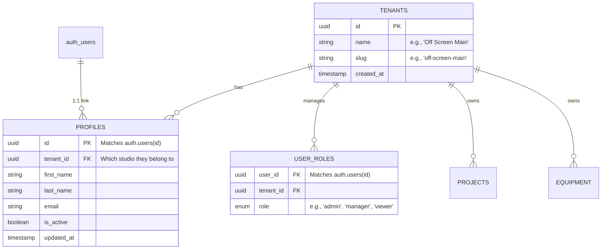

# Architecting a Multi-Tenant Supabase Application

Since you are building **OFF SCREEN** as a multi-tenant platform (where different AV studios or "tenants" will use the same application and database without seeing each other's data), we must implement strong Row Level Security (RLS) isolation at the Postgres level.

Here is the proposed architectural guide and **Database Schema Plan**. Please review this before we proceed to Phase 2 (generating the DB migration files).

---

## 1. Core Multi-Tenant Principles

- **Tenant Isolation**: Every tenant (Studio) gets a unique `tenant_id`. Every single table in the database that belongs to a studio (like `projects`, `equipment`, `customers`) will have a `tenant_id` column.
- **RLS Enforced Filter**: We will enforce RLS policies that automatically filter rows based on `(auth.jwt() ->> 'tenant_id')::uuid`. This ensures that even if the frontend requests `select * from equipment`, Supabase only returns equipment belonging to that user's specific tenant.
- **Custom JWT Claims**: When a user logs in, we inject their assigned `tenant_id` and `role` directly into the Supabase Session/JWT. This prevents doing a slow `JOIN` on every RLS check.

---

## 2. Proposed Schema (Mermaid)



---

## 3. How the Multitenant JWT Claims Work

We will create a **Postgres Trigger** inside Supabase. Whenever a session is created or a user gets a role applied, this trigger updates their Raw App Metadata with their `tenant_id` and `role`:

```json
{
  "role": "admin",
  "tenant_id": "848bd4cd-b362-4db1-93e1-31412df713b1"
}
```

Then, all our future RLS policies for `projects`, `equipment`, etc., will look like this:

```sql
CREATE POLICY "Tenant isolation for projects" 
ON public.projects 
FOR ALL 
USING (tenant_id = (select auth.jwt() ->> 'tenant_id')::uuid);
```

### Multitenant Users Constraint

By defining `tenant_id` inside `profiles` and `user_roles`, each user is tightly bound to a specific studio. If you plan to allow **one email to access multiple studios**, we must drop `tenant_id` from `profiles` and rely purely on the `user_roles` linking table. For most B2B internal admin apps, one user = one studio. *(Let me know which you prefer).*

---

## What's Next? (Phase 1 Action Required)

Are you okay with this **Shared Database, Row-Level-Security (RLS)** multitenant approach?
If you approve, I will proceed to **Phase 2**, which includes writing the exact `SQL` migrations for:
1. `tenants` and `profiles` tables.
2. The Supabase auth hook / JWT injection logic.
3. React Auth Providers implementing the login routing connecting to Supabase.
